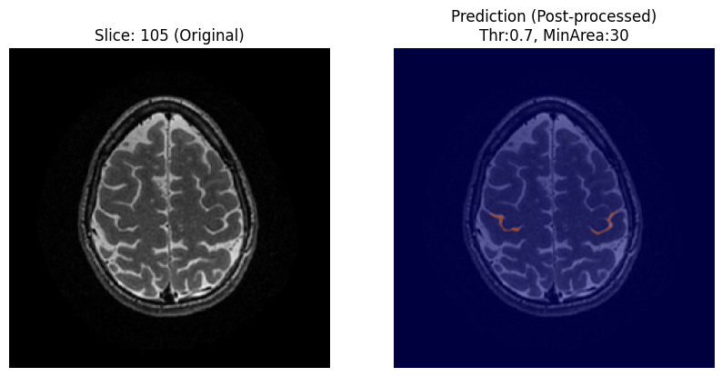

# AI-Powered Central Sulcus Segmentation Tool
### 頭部MRIにおける中心溝同定サポートツール


-green)


## 1. 概要 (Overview)
頭部MRI（T2強調像、**NIfTI / Zipped DICOM**）を入力すると、AIが中心溝（Central Sulcus）の位置を自動で同定し、元画像にヒートマップを重畳して出力するセグメンテーションツールである。

* **Target:** 医学生、研修医、脳の画像診断を専門としない医師
* **Goal:** 解剖学的同定のトレーニング支援、教育コストの低減、医療安全への貢献

## 2. 開発の背景と医学的意義 (Medical Context)
**【課題】**
中心溝（ローランド溝）は前頭葉と頭頂葉の境界であり、極めて重要な解剖学的ランドマークである。しかし、初学者には以下のような課題が存在する。
* **誤認のリスク:** 中心前回の病変を「頭頂葉の病変」と誤記するなど、重大なレポートミスの原因となる。
* **同定の難易度:** 典型的な「オメガサイン（Omega sign）」等の特徴を見つけるのが困難な症例が存在する。

**【解決策】**
専門医の「眼」を学習したAIによる可視化を通じ、学習者の正しい解剖理解を支援する。

## 3. 設計思想と医学的判断 (Design Philosophy & Medical Decisions)
本ツールの設計において、エンジニアリングの定石よりも「臨床データの実情」と「現場でのUX」を優先した点がいくつかある。
以下に、放射線診断専門医としての判断基準を詳述する。

### ▼ 1. なぜ3Dではなく「2D入力」を採用したのか？（医学的・実装的根拠）

本モデルでは、2.5D入力（隣接スライス入力）や3D入力も検討したが、最終的に**単一スライスによる2D入力**を採用した。

#### 3D入力を採用しなかった理由
本研究で用いたデータは2D撮像MRIであり、面内解像度に対してスライス厚が大きい（3-5mm）という**異方性**（Anisotropy）を有している。
3D CNNに入力するにはスライス間の補間処理（等方性化）が一般的だが、補間は連続的な解剖構造を仮定した人工的情報の付加（Artifact）であり、スライス間隔の広い臨床データにおいては実データに対する推論性能を損なうリスクがあると判断した。

また臨床的には、特にT2強調画像において3D撮像を routine で行っている施設は限られており、実運用時にはアプリケーション内で追加の補間処理を要する可能性が高い。このような前処理は推論時間の増加を招き、現場で求められる即時性やUXの観点から望ましくない。

#### 2D入力の採用理由（2.5Dの失敗分析）
検討段階では2.5D入力（隣接スライスを含む多チャネル入力）も試行したが、以下の理由で採用を見送った。

本研究で用いた学習データ（3–5mm厚）の条件下では、中心溝は隣接スライス間で**走行や形状が大きく変化**し、その変化の程度にも症例間でばらつきが生じる。
その結果、2.5D入力において隣接スライスの情報は一貫した特徴量として機能せず、むしろ症例間でノイズの寄与が不均一となり、モデルの汎化性能を低下させる（誤検出の増加・Dice低下）要因となったと考えられる。

### ▼ 2. なぜ Skull Stripping（頭蓋除去）を行わないのか？

一般的な脳画像解析では前処理としてSkull Strippingが行われるが、本ツールではあえて実施していない。

**理由1：UXと即時性（主要因）**
本アプリへの入力として想定される臨床データは、頭蓋除去が行われていないRawデータである。アプリ上でHD-BETのようなDeep Learningベースの頭蓋除去処理を走らせると、本番の推論よりも長い処理時間を要し、ユーザー体験（UX）を著しく損なう。

**理由2：解剖学的コンテキストの維持（副次的効果）**
検証の結果、頭蓋除去を行わないモデルの方が高精度であった。
放射線科医が中心溝を同定する際、脳実質だけでなく**脳表のCSF（脳脊髄液）スペースや頭蓋骨との位置関係**を重要な空間的手がかりとして利用している。頭蓋除去を廃止したことで、CNNがこの「周辺視の情報」を学習できた可能性が考えられる。

### ▼ 3. 適用範囲と学習データの限界（Dataset Limitations）

本モデルは特定のデータ分布（RSNA Intracranial Aneurysm Detection）に基づいて学習されており、以下の症例については学習データに含まれていない、あるいは解剖学的定義が困難であるため、**適応外**（Out of Distribution）となる可能性がある。

1. **小児症例 (Pediatric Cases):**
   学習データは成人症例で構成されており、脳回・脳溝が発達段階にある小児や、皮質形成異常などの先天的な形態変化には対応していない。
2. **解剖学的連続性の喪失 (Structural Disruption):**
   巨大な脳腫瘍、高度な脳浮腫、術後欠損などにより、中心溝および周辺の解剖学的ランドマークが物理的に歪曲・破壊されている症例。
3. **同定困難例 (Ambiguous Cases):**
   アノテーション段階で、専門医でも中心溝の同定に迷う症例や、軸位断（Axial）以外の断面は、学習および評価の対象外としている。

※なお、加齢に伴う一般的な**脳萎縮**（Brain Atrophy）や脳室拡大を伴う高齢者症例については、学習データに含まれており、本ツールの適用範囲内である。

本ツールは万能な診断機ではなく、「中心溝が定義可能な成人症例」における補助ツールとして設計されている。

## 4. 使用技術 (Tech Stack)
* **Language:** Python 3.12
* **Framework:** Streamlit (Web App)
* **Deep Learning:**
    * PyTorch, Segmentation Models Pytorch (SMP)
    * **Model Architecture:** **U-Net** (Backbone: ResNet34, Pre-trained on ImageNet)
* **Medical Image Processing:** Nibabel, Pydicom
* **Annotation:** **3D Slicer**

### Key Features & UX Design
* **Inference Modes:**
    * **Fast Mode:** 単一モデルによる高速推論（スクリーニング用）。
    * **Ensemble Mode:** 5-fold CVモデルによるアンサンブル推論（精査用）。
* **Interactive Post-processing:**
    * **Probability Threshold:** 検出感度をスライダーで調整可能（Default: 0.7）。
    * **Minimum Area:** 微小ノイズ除去（Default: 30）。
    * **Center Mask Size:** 正中部の除外領域（Default: 0.25）。

## 5. データセットと戦略 (Dataset & Strategy)
### Datasets
* **Training:** [RSNA Intracranial Aneurysm Detection](https://kaggle.com/competitions/rsna-intracranial-aneurysm-detection) (Kaggle) より抽出した**48症例**。
* **Demo Data:** [IXI Dataset](https://brain-development.org/ixi-dataset/) (CC BY-SA 3.0)

> **Note: Domain Shift**
> 学習データ（3-5mm厚）に対し、デモデータ（1mm厚）は高解像度であるため、推論精度が変動する場合がある。

### Data Curation (Data-Centric Approach)
* **Stratified Sampling (層化抽出):**
    DICOMメタデータを解析し、「**MRI機種（Vendor）**」「**磁場強度（1.5T/3.0T）**」「**患者年齢**」「**スライス厚**」の分布がTrain/Val/Testデータにおいて大きく偏らないようサンプリングを行った。臨床データの不均質性（Heterogeneity）を考慮した設計である。
* **Strict Negative Sampling (厳密な背景画像選定):**
    学習データおよび検証データの**全症例を目視確認**し、「中心溝が明らかに存在しないスライス番号」を特定・リスト化した上で、そこからランダムに背景画像を抽出した。
    * **意図:** 未アノテーションの中心溝が含まれるスライスを誤って「背景（負例）」として学習させることを防ぎ、AIが「アノテーションされていない中心溝」も正しく認識できる**汎化性能を維持するため**の処置である。
* **Expert Annotation:**
    放射線診断専門医（著者本人）が**約40時間**を費やし、48症例のマスクをPixel単位で作成した。単なる正解ラベルではなく、臨床的な妥当性を担保した「**High-Quality Ground Truth**」である。

## 6. 後処理と評価 (Post-processing & Results)

### Post-processing (False Positive Reduction)
誤検出を排除するため、独自のアルゴリズムを実装した。以下の処理を順次適用している。
1.  **Probability Thresholding:** 推論された確率マップを閾値（Default: 0.7）で二値化。
2.  **Center Masking:** 脳深部・正中部の誤検出を防ぐため、画像の中心領域に含まれるオブジェクトを除外。
3.  **Hemisphere Processing:**
    画像を左右半球に分割し、各サイドで**最大面積を持つ領域のみ**を抽出。
    * *Note:* 抽出された領域が最小面積（Minimum Area / Default: 30px）未満の場合はノイズと見なし、除外する。

### Evaluation
* **定量評価 (Quantitative):**
    * **Dice Coefficient: 0.917** (Test Data)
* **定性評価 (Qualitative):**
    * テストデータ全8症例に対し、放射線診断専門医による目視評価を実施。
    * **結果: 正解率 100%** (Score 2以上)

| Score | 判定 | 定義 (Criteria) |
| :---: | :--- | :--- |
| **3** | **Excellent** | アノテーションされた全ての中心溝を広く被覆しており、かつ誤検出がない。 |
| **2** | **Useful** | 複数のスライスにわたり被覆している。軽微な誤検出はあるが医学的判断を妨げない。 |
| **1** | **Poor** | 被覆が不十分（1スライス以下）、あるいは別の脳溝を誤認している。 |

### Robustness Check
**Motion Artifact**（体動）や**Brain Lesions**（白質病変）を含む難易度の高い症例でも、破綻なく動作することを確認した。

#### Output Example (Inference on Open Data)
*Note: Due to license restrictions of the training dataset (RSNA/Kaggle), the images shown below are from the IXI Dataset (CC BY-SA 3.0).*



*Left: Original T2WI (IXI Dataset), Right: AI Prediction (Post-processed)*


## 7. 考察と開発プロセス (Discussion)

**モデル選定と精度検証 (Model Selection & Ablation Study)**
本プロジェクトでは、最適な条件を選定するために以下の比較実験を行った。

| ID | Skull Strip | Input | Negative Sampling | Other Settings | Dice (Test) | 備考 |
| :---: | :---: | :---: | :---: | :--- | :---: | :--- |
| ① | Yes (HD-BET) | 2D | No | - | 0.8693 | ベースライン |
| ② | **No** | **2D** | No | - | **0.9185** | **数値上の最高値** |
| ③ | No | 2D | 10% | - | 0.9151 | 誤検出なし |
| ④ | No | 2.5D | No | - | 0.8552 | 誤検出増加 |
| ⑤ | No | 2.5D | 20% | Early Stop | 0.8885 | - |
| **⑥** | **No** | **2D** | **20%** | **Scheduler + Early Stop** | **0.9174** | **最終採用 (Final Model)** |

**考察と「Dice係数のパラドックス」 (Findings & The "Dice Paradox")**

1.  **Skull Stripping Freeの優位性（① vs ②）:**
    頭蓋除去（①）よりも、除去なし（②, ⑥）の方が高精度であった。これは前述の通り、脳表のCSF信号が空間的手がかりとして機能したためと考えられる。

2.  **Dice係数の限界と汎化性能:**
    数値上はモデル②が最高値であったが、本プロジェクトではDice係数を絶対視しなかった。厳密なNegative Samplingにより、AIが未アノテーションの中心溝まで同定（汎化）した場合、計算上のDice係数は低下する（パラドックス）。
    私はこの数値低下を「**AIが解剖学的構造を深く理解した証左（Positive Generalization）**」と判断し、ノイズ抑制に優れたモデル⑥を採用した。

## 8. 今後の課題 (Future Work)
* **Model-Assisted Annotation:** 本モデルを「3D教師データ作成支援」に転用し、3D CNN開発コストを低減する。
* **Test-Time Augmentation (TTA):** 推論時の精度向上。

## License
* **Source Code:** [MIT License](LICENSE)
* **Model Weights:** Non-Commercial / Research Use Only
* **Demo Data:** [CC BY-SA 3.0](https://creativecommons.org/licenses/by-sa/3.0/)

## Acknowledgements & Citation

This project uses the dataset from the RSNA Intracranial Aneurysm Detection competition hosted on Kaggle for **training purposes only**. The raw competition data is NOT included in this repository/application in compliance with the competition rules.

```bibtex
@misc{rsna-intracranial-aneurysm-detection,
    author = {Jeff Rudie, Evan Calabrese, et al.},
    title = {RSNA Intracranial Aneurysm Detection},
    year = {2025},
    howpublished = {\url{https://kaggle.com/competitions/rsna-intracranial-aneurysm-detection}},
    note = {Kaggle}
}
```

---
**Author:** T. Higuchi, M.D. - Board Certified Radiologist